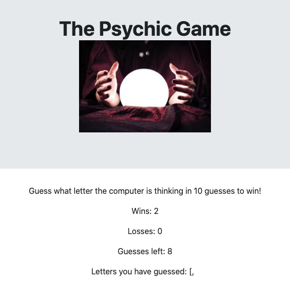

# Psychic-Game
## by Steffi Wellington
1. Guess the letter the computer has chosen. 
2. You have 5 chances to guess the correct letter. 
3. After you have either guessed the correct answer or have reached 5 guesses then you will have either an increase display in the wins or losses. 
4. Keep playing as long as you would like to! 
5. Have a good time!

### What is this?
The beginning of the Journey deep into Javascript.

### Who is it for?
Anyone looking to learn to build out a javascript Psychic Game this is a good practice problem. Build a Psychic Game from scratch! Take a look at mine for inspiration! 

### How do I use this myself?
You can use this code yourself by first copying the code and using git clone in your terminal or your command prompt and then to see the finished product you can go ahead and open this code in Visual Studio code and right click on the index.html to open this in browser. Take a look at the Psychic Game and take a look at the code. The real challenge is when you close out of my code and try to recreate it yourself from scratch! You can do this!

 * Here is what my Psychic game looks like and if you click the picture you can go straight to looking through the portfolio!

